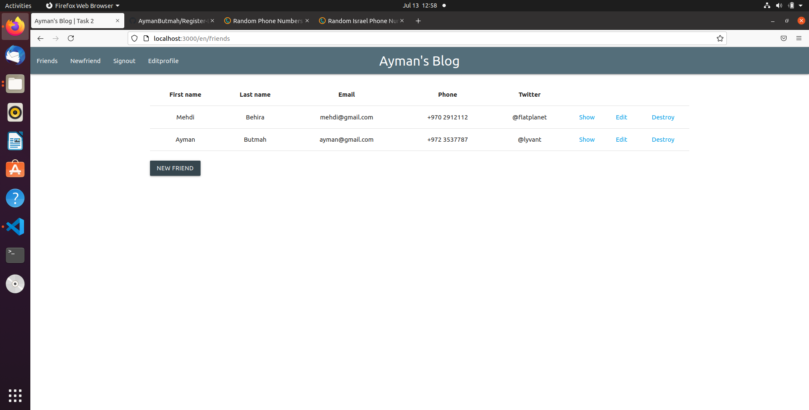

     
# Ruby-on-Rials-Friends-App

## Requiremnsts 

•	Ubuntu 18.04 or higher

•	RoR installed

•	PostgreSQL installed

• Gemfile bundle i

## Demo

## Refernces (Book)
Learn Ruby On Rails For Web Development: Learn Rails The Fast And Easy Way Kindle Edition by John Elder 

## ContactMe :smile:
[linkedin](https://www.linkedin.com/in/ayman-butmah-816b361b3/)
